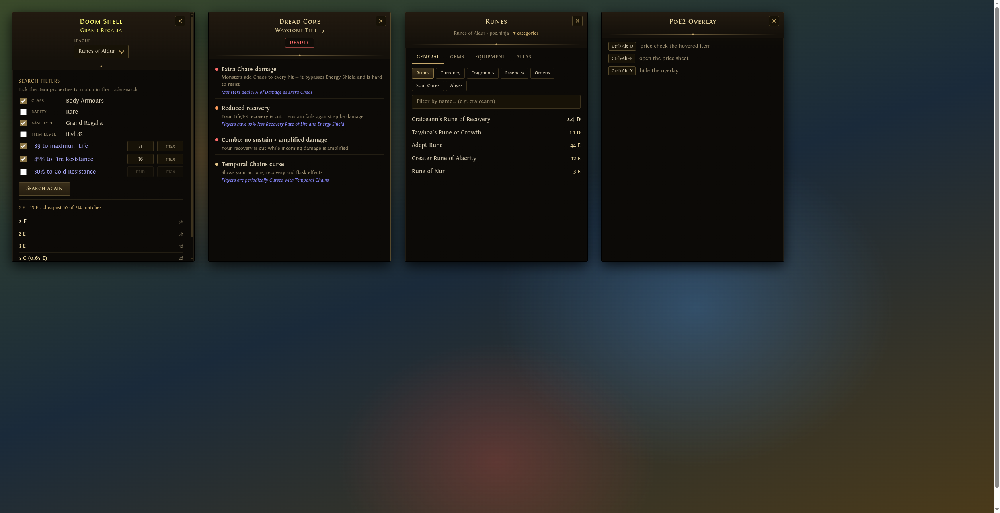

# Design

The overlay borrows PoE2's item-tooltip vocabulary so it reads as part of the game,
not a desktop app (see PRODUCT.md). All tokens live as CSS custom properties on
`.overlay-root` in `src/App.vue`.

_(regenerate: rebuild, then screenshot the preview harness — a static page reusing the
built scoped CSS with sample data for each state)_

## Theme

Dark, warm, near-black glass with bronze/gold chrome. The panel sits over a bright
game scene, so backgrounds are solid (a translucent panel washed out — T3/ADR-0003)
and text contrast is kept ≥ 4.5:1.

## Color palette

| Token | Value | Role |
|---|---|---|
| `--bg` | `#0c0a07` | panel body (solid; header fades from `#141008`) |
| `--bg-raised` | `#171207` | inputs, selects, kbd chips, close button |
| `--edge` | `#574a2c` | primary bronze border |
| `--edge-dim` | `#3d331e` | quiet borders (inputs, chips, scrollbar thumb) |
| `--edge-hi` | `#8a7444` | hover/focus border, checkbox accent |
| `--ink` | `#d6cbb2` | body text |
| `--ink-dim` | `#9a8d70` | secondary text, labels |
| `--gold` | `#c8aa6d` | PoE gold: spread, section titles, regex text |
| `--gold-bright` | `#e8d5a0` | headers, prices, button text |

Rarity colors (sRGB canon from the game, on the item-name header only): normal
`#c8c8c8`, magic `#8888ff`, rare `#ffff77`, unique `#af6025`, currency `#aa9e82`.

Severity (waystone danger, always paired with a text label): safe `#8fe3a0`,
caution `#e8c98a`, dangerous `#ff9d5c`, deadly `#ff6b6b`. Error text `#ff8f7d`.

## Typography

- `--serif`: `Fontin, "Palatino Linotype", Palatino, Georgia, serif` — body, 15px/1.45.
- `--smallcaps`: `"Fontin SmallCaps", Fontin, …` — item name (19px), section titles,
  tabs, buttons, badges. Fontin is the game's own typeface; it is **not
  redistributable**, so `packaging/install.sh` fetches it from exljbris into
  `~/.local/share/fonts/fontin/` and the stack degrades to system serifs without it.
- JetBrains Mono only for regex patterns.
- Weights: Fontin ships 400/700 only — never use 500/600.

## Components

- **Card frame**: 1px `--edge` border + `box-shadow: 0 0 0 1px #000` outer line +
  faint gilt inset — the tooltip double-edge idiom. Radius 3px everywhere (PoE UI is
  squared; no pills).
- **Header plate**: a full-bleed darker band (`#221a10 → #14100a`, negative margins
  into the card padding) carrying the centered item name — PoE2's tooltip header
  strip. Rare/unique names stack on two lines (name over base type, `.name-base`);
  the frontend splits the backend's `"Name (Base Type)"`. Closed by a gilt separator
  with a centered dot ornament (`.head::after`, layered radial + linear gradients).
- **Mod text**: stat filter lines use the game's magic-mod blue (`#a8a8f8`,
  lightened for small-size contrast); base properties stay parchment — mirroring how
  a real tooltip separates mods from item fields.
- **Severity badges**: colored text + matching translucent border on a dark plate
  (the map-mod idiom), never a filled color pill.
- **Buttons**: bronze-framed dark gradient (`#3a2f1a → #241c0f`), small-caps gold
  text; hover brightens the border and adds a faint gold glow. Same vocabulary for
  the requery button and active category chips.
- **Listings**: hairline `rgba(200,170,109,.12)` row separators; the cheapest
  (first) price is one step larger — the glanceable verdict.
- **Empty state**: teaches the three hotkeys with `kbd` chips.

## Motion

State-only: a 1.2s opacity pulse on "Searching market…", 150ms border/color
transitions on hover. Both disabled under `prefers-reduced-motion`. Nothing
decorative — WebKitGTK repaint cost is a real constraint (ADR-0003).
